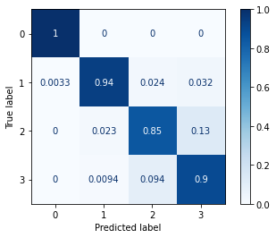

# Infineon Hackathon

## Overview

Welcome to the Infineon Hackathon repository! This project aims to develop a solution for classifying radar data collected from Infineon sensors in various indoor environments. The goal is to accurately determine the number of people present based on the radar readings.

## Table of Contents

- [Data Preprocessing](#data-preprocessing)
  - [BCL Environments](#bcl-environments)
  - [Nave Environment](#nave-environment)
  - [ED 16 Environment](#ed-16-environment)
- [Dataset](#dataset)
- [Model Building](#model-building)
- [Training](#training)
- [Results](Results)
- [License](#license)

## Data Preprocessing

The collected radar data needs to be preprocessed before training the model. This involves transforming the raw data into a suitable format for classification. The data was collected during the hackaton. We created 3 different environments each with 4 classes ( number of people, 0, 1, 2, 3 ).
The preprocessing module in this project contains functions for applying range and Doppler fast Fourier transform (FFT) to radar data. These functions are implemented in Python and utilize the NumPy library.

## Dataset

To enhance the model's generalization capabilities, we combine the data from the three different environments (BCL, Nave, ED 16) into a single dataset. This unified dataset provides a more comprehensive representation of indoor environments, promoting better performance across various scenarios.

## Model Building

In this project, we utilize a convolutional neural network (CNN) for the classification task. The model takes input from the radar frames captured by the three antennas of the Infineon sensor. These frames are combined to create a multidimensonal matrix with 3 channels ( same format as RGB images ), which serve as the input data for the network. Specifically, the input shape is set to (64, 64, 3).

To expedite the training process, we employ transfer learning. We use a pretrained network, EfficientNetV2L, and fine-tune the layers starting from the 700th position. This approach allows us to leverage the learned features from a larger dataset. The resulting model consists of approximately 64 million parameters.

## Training

The model is trained on the unified dataset for 100 epochs. During training, both the training and validation accuracies are monitored to assess the model's progress. The optimization parameters, including the loss function, learning rate, and optimizer, are configured accordingly.

To evaluate the model's performance, we utilize a separate dataset from 1 of the 3 environment. The range-doppler maps of the radar data are processed using the predefined functions, and predictions are made using the trained model. A confusion matrix is generated to provide insights into the model's classification accuracy.

## Results

## Contributors 

[Irene Rigato](https://github.com/bioshot-dotcom)

[Juan Calderon](https://github.com/calde97)

[Stefano Chinga](https://github.com/robertsteven97)

